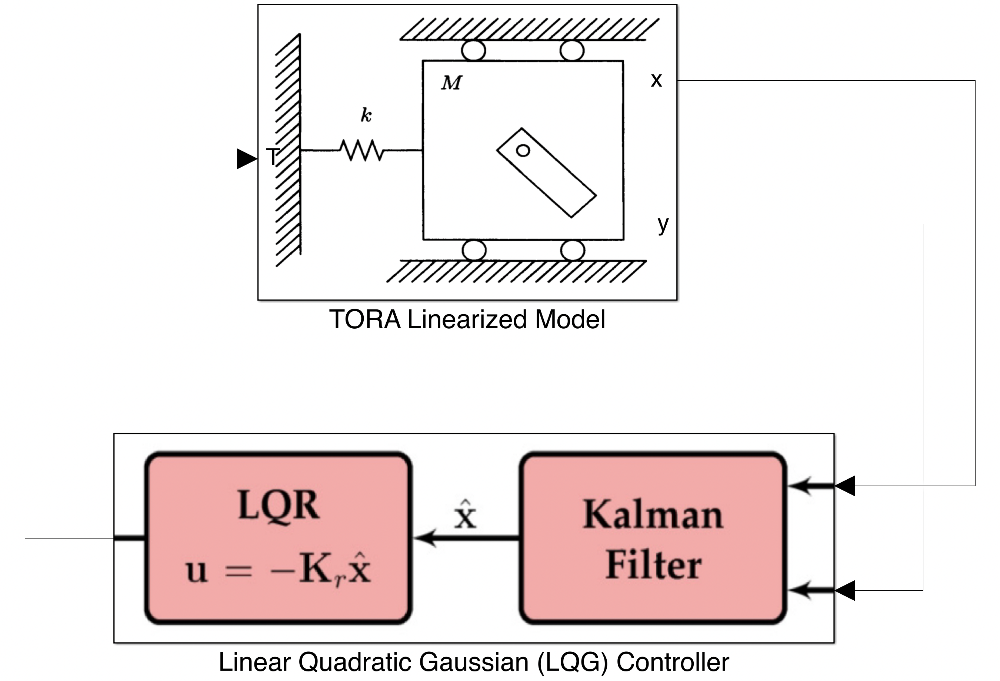

# statespace-control-system

modelling, design & analysis of a complete output-feedback control system for the translational oscillator with rotational actuator (TORA) system

the design of a state-feedback controller through linear quadratic regulation (LQR) & an output-feedback controller through linear quadratic estimation (LQE) computed following optimal control concepts. 

the combined system formed a linear quadratic gaussian (LQG) controller was analyzed for its performance in terms of design stability, model uncertainty compensation, disturbance rejection, and noise attenuation

# TORA System & LQG Controller

